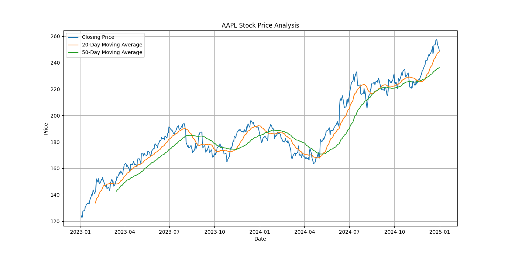
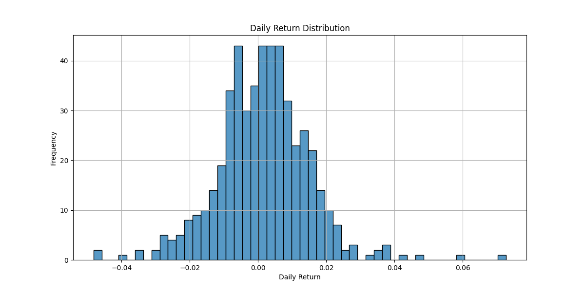

# 📈 Stock Market Data Analyzer

A Python-based financial analytics project that fetches stock market data, performs trend and risk analysis, and generates professional visualizations and reports using real-time stock data from Yahoo Finance.

---

# 🚀 Live Demo

🔗 Live Application:

[Stock Market Data Analyzer Demo](https://stock-market-data-analyzer-mze3gcd5ved9huaz5mwouk.streamlit.app/?utm_source=chatgpt.com)

---

# 📌 Project Overview

The **Stock Market Data Analyzer** is an industry-oriented Python project designed to analyze stock market trends using financial data.

This project demonstrates:

- Financial data analysis
- Time-series analysis
- Data visualization
- Automation using Python
- Risk and return analysis
- Report generation

The system collects stock market data, processes it, calculates financial metrics, and generates charts and reports useful for investors, analysts, traders, and finance teams.

---

# 🎯 Problem Statement

Investors and analysts often need to:

- Track stock performance
- Analyze market trends
- Calculate returns
- Measure volatility and risk
- Generate reports for decision-making

Doing all this manually is time-consuming and inefficient.

This project automates the complete stock analysis workflow using Python.

---

# 💡 Industry Relevance

Financial institutions and FinTech companies use similar systems for:

- Investment research
- Market tracking
- Portfolio analysis
- Risk management
- Trend forecasting
- Financial reporting

This project simulates a beginner-level financial analytics platform.

---

# ✨ Features

✅ Fetch stock market data using Yahoo Finance API  
✅ Interactive stock analysis dashboard  
✅ Daily returns calculation  
✅ Moving average analysis  
✅ Volatility and risk analysis  
✅ Highest and lowest price analysis  
✅ Stock trend visualization  
✅ Return distribution analysis  
✅ Financial summary generation  
✅ Streamlit web deployment  

---

# 🛠️ Tech Stack

| Technology | Purpose |
|---|---|
| Python | Core programming |
| Pandas | Data analysis |
| NumPy | Numerical operations |
| Matplotlib | Data visualization |
| Seaborn | Statistical plots |
| yfinance | Stock market API |
| Streamlit | Interactive dashboard |

---

# 📂 Project Structure

```text
Stock-Market-Data-Analyzer/
│
├── data/
│   └── stock_data.csv
│
├── images/
│   ├── stock_trend.png
│   └── daily_returns.png
│
├── reports/
│   └── summary_report.csv
│
├── notebooks/
├── src/
├── outputs/
├── docs/
│
├── main.py
├── app.py
├── requirements.txt
├── README.md
└── .gitignore
```

---

# ⚙️ Installation Guide

## 1️⃣ Clone Repository

```bash
git clone YOUR_GITHUB_REPOSITORY_LINK
```

---

## 2️⃣ Move Into Project Folder

```bash
cd Stock-Market-Data-Analyzer
```

---

## 3️⃣ Create Virtual Environment (Optional)

### Windows

```bash
python -m venv venv
venv\Scripts\activate
```

### Mac/Linux

```bash
python3 -m venv venv
source venv/bin/activate
```

---

## 4️⃣ Install Required Libraries

```bash
pip install -r requirements.txt
```

OR

```bash
pip install pandas numpy matplotlib seaborn yfinance streamlit
```

---

# ▶️ How To Run

## Run Main Project

```bash
python main.py
```

---

## Run Streamlit Dashboard

```bash
streamlit run app.py
```

---

# 📊 Workflow

```text
Stock Data Collection
        ↓
Data Cleaning
        ↓
Trend Analysis
        ↓
Moving Average Calculation
        ↓
Returns Calculation
        ↓
Volatility Analysis
        ↓
Visualization
        ↓
Report Generation
```

---

# 📈 Financial Analysis Performed

## 1️⃣ Daily Returns

Measures day-to-day stock performance.

Formula:

```text
Return = (Current Price - Previous Price) / Previous Price
```

---

## 2️⃣ Moving Averages

Used to identify stock trends.

- MA20 → Short-term trend
- MA50 → Long-term trend

---

## 3️⃣ Volatility Analysis

Measures stock risk and price fluctuations.

Higher volatility = Higher risk.

---

# 📷 Sample Outputs

## Generated Charts

- Stock Closing Price Chart
- Moving Average Trend Chart
- Daily Return Distribution Chart

## Generated Reports

- Summary CSV Report
- Volatility Analysis
- Price Statistics

---

# 📸 Screenshots

Add screenshots here after running the project:

## Dashboard Preview


---

## Stock Trend Chart



---

## Daily Returns Distribution



---

## Terminal Output


---

# 📊 Example Analysis

Example stock used:

```text
AAPL (Apple Inc.)
```

The system analyzes:

- Price trends
- Daily returns
- Moving averages
- Volatility
- Market performance

---

# 🔥 Learning Outcomes

Through this project, I learned:

- Financial data analysis
- Time-series analytics
- Python automation
- API integration
- Data visualization
- Risk analysis
- Streamlit deployment
- GitHub project management

---

# 🚀 Future Improvements

Possible future enhancements:

- Real-time stock dashboard
- Multiple stock comparison
- Machine learning stock prediction
- Portfolio management system
- Candlestick charts
- PDF report generation
- Database integration

---

# 👨‍💻 Author

Yashika Aggarwal

---

# 📌 GitHub Topics / Tags

```text
python
finance
stock-market
data-analysis
pandas
numpy
matplotlib
seaborn
yfinance
fintech
streamlit
visualization
```

---

# ⚠️ Disclaimer

This project is developed for educational purposes only.

It does not provide financial or investment advice.
